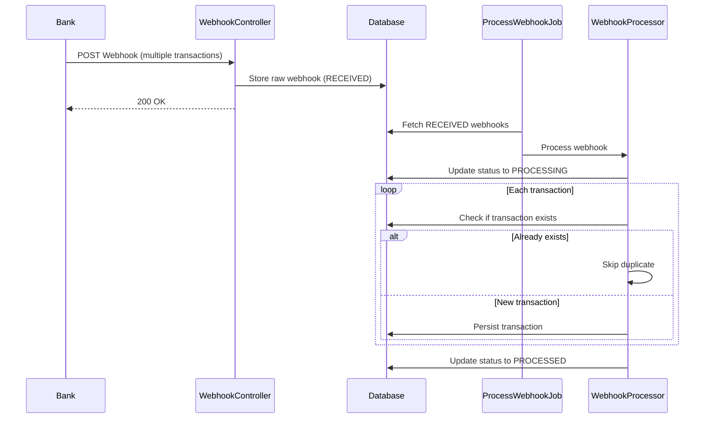
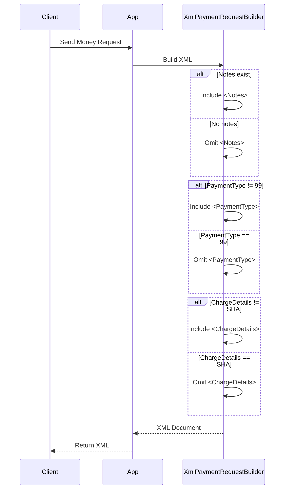
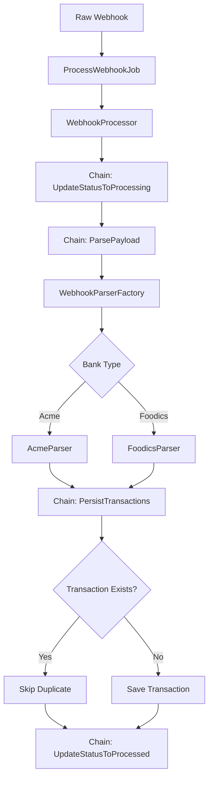

# Online Wallet Challenge – Design & Implementation Guide
### AI README GENERATED
## Purpose of this Document

This document explains the architectural decisions, implementation patterns, and testing strategy for the Online Wallet Challenge. It serves as a human-to-human explanation of how the system was designed, which trade-offs were considered, and how financial system patterns influenced the final implementation.

---

## Problem Overview

The challenge involves two independent responsibilities:

1. **Receiving Money** – Reliably handling incoming bank webhooks
2. **Sending Money** – Generating bank-compliant XML payment requests

These concerns are deliberately decoupled to ensure each can evolve independently and maintain appropriate levels of reliability and safety.

---

## Core Design Principles

Before implementation, three guiding questions shaped the design:

1. **What data must never be lost?**
2. **What actions must be idempotent by design?**
3. **Which parts are explicitly out of scope and should remain pure functions?**

These questions removed ambiguity and prevented over-engineering in the wrong areas.

---

## Project Structure

```
app/
├── Builder/
│   ├── PaymentRequestBuilder.php
│   └── XmlPaymentRequestBuilder.php
├── Factory/
│   └── WebhookParserFactory.php
├── Http/
│   └── Controllers/
│       └── WebhookController.php
├── Jobs/
│   └── ProcessWebhookJob.php
├── Models/
│   ├── Client.php
│   ├── Transaction.php
│   └── Webhook.php
├── Parsing/
│   ├── AcmeParser.php
│   ├── FoodicsParser.php
│   └── WebhookParser.php
├── Processors/
│   └── WebhookProcessor.php
├── Utility/
│   └── DateParser.php
└── WebhookChain/
    ├── ParsePayloadHandler.php
    ├── PersistTransactionsHandler.php
    ├── UpdateStatusToProcessedHandler.php
    ├── UpdateStatusToProcessingHandler.php
    └── WebhookHandler.php

database/
├── factories/
│   ├── ClientFactory.php
│   ├── UserFactory.php
│   └── WebhookFactory.php
├── migrations/
│   ├── 0001_01_01_000000_create_users_table.php
│   ├── 0001_01_01_000001_create_cache_table.php
│   ├── 0001_01_01_000002_create_jobs_table.php
│   ├── 2025_12_24_194358_create_personal_access_tokens_table.php
│   ├── 2025_12_24_201448_create_clients_table.php
│   ├── 2025_12_24_202314_create_transactions_table.php
│   └── 2025_12_24_203425_create_webhooks_table.php
└── seeders/

tests/
├── Feature/
│       └── XmlPaymentRequestBuilderTest.php
│── Integration/
│       └── WebhookProcessorTest.php
└── Unit/
    ├── Handlers/
    │    └── WebhookProcessorTest.php
    ├── Parsers/
    │    └── FoodicsParserTest.php
    └── ExampleTest.php
```

---

## Part 1: Receiving Money (Webhook Ingestion)

### Core Problem

Banks send webhooks that may:

* Contain multiple transactions per request
* Be retried multiple times
* Arrive while the system is under maintenance or experiencing high load

The challenge explicitly requires:

> The app must be able to stop processing webhooks without dropping incoming webhooks.

This requirement demands **durability before processing**.

---

### Key Decision 1: Separate Ingestion from Processing

**Why this matters:**

Processing webhooks inside the HTTP request lifecycle creates several risks:

* Webhook loss during deployments or crashes
* Slow responses causing bank retries
* No safe way to pause processing

**Implementation:**

* The HTTP endpoint (`WebhookController`) only **accepts and persists** the webhook payload
* Actual parsing and transaction importing happen asynchronously via `ProcessWebhookJob`

This aligns with industry patterns used in payment systems and event-driven architectures.

---

### Key Decision 2: Persist Raw Webhooks First

**Why raw storage matters:**

Storing raw webhook payloads ensures:

* No financial event is lost
* Parsing bugs do not cause permanent data loss
* Reprocessing is possible if logic changes

**Storage Model:**

* A `webhooks` table stores the raw payload and processing state
* Status transitions: `RECEIVED` → `PROCESSING` → `PROCESSED`

This design enables controlled back-pressure and operational safety.

---

### Key Decision 3: Idempotent Transaction Import

**Why idempotency is mandatory:**

Banks may legitimately send the same transaction multiple times. This is not an error.

**Implementation Pattern:**

* Each transaction is identified by a **unique reference**
* The database enforces uniqueness constraints
* Application logic treats duplicates as no-ops

This creates an **exactly-once business effect** over an **at-least-once delivery mechanism**.

---

### Receiving Money Flow



---

## Part 2: Sending Money (XML Generation)

### Understanding the Scope

The challenge explicitly states:

> Communication with the bank or tracking the transfer in the database are out of scope.

**Implementation Approach:**

* The sending flow is implemented as a **pure XML generator**
* No database access
* No HTTP communication
* No state tracking

This ensures compliance with the challenge while keeping responsibilities clean.

---

### Key Decision 4: Conditional XML Serialization

**Why conditional fields exist:**

Bank XML contracts often define **implicit defaults**. Sending default values explicitly may:

* Break validation
* Violate legacy schemas
* Cause unexpected rejections

**Applied Rules:**

* `Notes` is included only when notes exist
* `PaymentType` is included only when value ≠ 99
* `ChargeDetails` is included only when value ≠ SHA

This treats XML generation as **protocol compliance**, not data dumping.

---

### Sending Money Flow



---

## Design Patterns Used

### 1. Chain of Responsibility Pattern

**Location:** `app/WebhookChain/`

**Purpose:** Progressive processing of webhooks through multiple handlers

**Handlers:**
* `UpdateStatusToProcessingHandler` – Marks webhook as being processed
* `ParsePayloadHandler` – Parses raw JSON payload
* `PersistTransactionsHandler` – Saves transactions to database
* `UpdateStatusToProcessedHandler` – Marks webhook as completed

Each handler:
* Evaluates one concern
* Either passes the webhook forward or stops the chain
* Allows rules to be reordered, removed, or extended safely

---

### 2. Strategy Pattern

**Location:** `app/Parsing/`

**Purpose:** Different parsing strategies for different bank formats

**Implementation:**
* `WebhookParser` – Interface defining the contract
* `AcmeParser` – Concrete strategy for Acme bank format
* `FoodicsParser` – Concrete strategy for Foodics format

This allows transaction parsing logic to evolve independently without modifying the processing pipeline.

---

### 3. Factory Pattern

**Location:** `app/Factory/WebhookParserFactory.php`

**Purpose:** Selects the appropriate parser based on webhook source

**Responsibility:**
* Inspects webhook attributes (bank name, format indicators)
* Returns the appropriate Parser instance

This centralizes decision logic and makes parser registration explicit.

---

### 4. Builder Pattern

**Location:** `app/Builder/`

**Purpose:** Constructs XML incrementally with conditional fields

**Implementation:**
* `PaymentRequestBuilder` – Interface
* `XmlPaymentRequestBuilder` – Concrete builder

**Benefits:**
* Each optional section is added conditionally
* Final output is deterministic and side-effect free
* Keeps XML generation readable and auditable

---

### 5. Idempotent Consumer Pattern

**Implementation:** Throughout webhook processing

**Key Points:**
* Uniqueness enforced at persistence layer
* Application logic treats replays as successful no-ops
* Ensures correctness regardless of delivery semantics

---

### Pattern Interaction



---

## Database Schema

### Webhooks Table

```sql
CREATE TABLE webhooks (
    id BIGINT PRIMARY KEY AUTO_INCREMENT,
    bank_name VARCHAR(255) NOT NULL,
    bank_reference VARCHAR(255) NOT NULL,
    raw_payload JSON NOT NULL,
    status ENUM('RECEIVED', 'PROCESSING', 'PROCESSED', 'FAILED') DEFAULT 'RECEIVED',
    processed_at TIMESTAMP NULL,
    created_at TIMESTAMP DEFAULT CURRENT_TIMESTAMP,
    updated_at TIMESTAMP DEFAULT CURRENT_TIMESTAMP ON UPDATE CURRENT_TIMESTAMP,
    UNIQUE KEY unique_webhook (bank_name, bank_reference)
);
```

### Transactions Table

```sql
CREATE TABLE transactions (
    id BIGINT PRIMARY KEY AUTO_INCREMENT,
    client_id BIGINT NOT NULL,
    webhook_id BIGINT NOT NULL,
    reference VARCHAR(255) NOT NULL UNIQUE,
    amount DECIMAL(15, 2) NOT NULL,
    currency VARCHAR(3) NOT NULL,
    transaction_date TIMESTAMP NOT NULL,
    notes TEXT NULL,
    created_at TIMESTAMP DEFAULT CURRENT_TIMESTAMP,
    updated_at TIMESTAMP DEFAULT CURRENT_TIMESTAMP ON UPDATE CURRENT_TIMESTAMP,
    FOREIGN KEY (client_id) REFERENCES clients(id),
    FOREIGN KEY (webhook_id) REFERENCES webhooks(id)
);
```

### Clients Table

```sql
CREATE TABLE clients (
    id BIGINT PRIMARY KEY AUTO_INCREMENT,
    name VARCHAR(255) NOT NULL,
    email VARCHAR(255) NOT NULL UNIQUE,
    balance DECIMAL(15, 2) DEFAULT 0.00,
    created_at TIMESTAMP DEFAULT CURRENT_TIMESTAMP,
    updated_at TIMESTAMP DEFAULT CURRENT_TIMESTAMP ON UPDATE CURRENT_TIMESTAMP
);
```

---

## Testing Strategy

### Unit Tests

**Location:** `tests/Unit/`

**Coverage:**
* Each Parser is unit tested against all possible input variations
* Chain handlers are independently tested
* XML Builder is tested to ensure correct conditional inclusion of fields
* Date parsing utilities are tested with various formats

**Example:**
```php
public function test_acme_parser_handles_valid_payload()
{
    $parser = new AcmeParser();
    $result = $parser->parse($validPayload);
    
    $this->assertCount(2, $result);
    $this->assertEquals('TXN123', $result[0]['reference']);
}
```

---

### Integration Tests

**Location:** `tests/Feature/Integration/`

**Coverage:**
* Endpoint receives sample webhooks and persists raw payload
* Job processes pending webhooks and ensures:
    * Duplicate transactions are ignored
    * Correct linking to clients
    * Status transitions are accurate

**Example:**
```php
public function test_webhook_processing_end_to_end()
{
    $webhook = Webhook::factory()->create(['status' => 'RECEIVED']);
    
    ProcessWebhookJob::dispatch($webhook);
    
    $webhook->refresh();
    $this->assertEquals('PROCESSED', $webhook->status);
    $this->assertDatabaseHas('transactions', ['webhook_id' => $webhook->id]);
}
```

---

### Idempotency Tests

**Purpose:** Ensure duplicate webhooks don't create duplicate transactions

**Test Cases:**
* Send the same webhook multiple times
* Ensure final transaction state is unchanged
* Validate that repeated processing doesn't create duplicates

```php
public function test_duplicate_webhooks_are_idempotent()
{
    $payload = ['bank_name' => 'Acme', 'bank_reference' => 'REF123'];
    
    // Process twice
    $this->postJson('/api/webhooks', $payload);
    $this->postJson('/api/webhooks', $payload);
    
    // Should have only one webhook
    $this->assertDatabaseCount('webhooks', 1);
}
```

---

### Performance Tests

**Purpose:** Verify system handles high-volume webhooks

**Test Cases:**
* Parse webhook containing 1,000+ transactions
* Assert processing time is within acceptable limits
* Verify database uniqueness constraints under concurrent insertion

---

## Operational Considerations

### Back-pressure Handling

* Use persistent storage (database + job queue) to safely buffer incoming webhooks
* Processing can be paused without losing data
* Queue workers can be scaled independently

### Monitoring

* Track `webhooks` table processing status
* Monitor queue depth to detect backlog
* Alert on webhooks stuck in `PROCESSING` state

### Error Handling

* Catch and log parsing errors
* Mark webhook as `FAILED` for later inspection
* Preserve raw payload for debugging

### Scaling

* Workers can run in parallel
* Database indexes support high-volume transaction lookups
* Horizontal scaling possible through additional queue workers

---

## Key Implementation Notes

### Webhook Controller

```php
public function store(Request $request)
{
    $webhook = Webhook::create([
        'bank_name' => $request->input('bank_name'),
        'bank_reference' => $request->input('bank_reference'),
        'raw_payload' => $request->all(),
        'status' => 'RECEIVED',
    ]);
    
    ProcessWebhookJob::dispatch($webhook);
    
    return response()->json(['status' => 'received'], 200);
}
```

**Key Points:**
* Only responsibility is to persist and acknowledge
* Fast response to bank
* No processing in HTTP lifecycle

---

### Webhook Processor

```php
public function process(Webhook $webhook)
{
    $handlers = [
        new UpdateStatusToProcessingHandler(),
        new ParsePayloadHandler(),
        new PersistTransactionsHandler(),
        new UpdateStatusToProcessedHandler(),
    ];
    
    foreach ($handlers as $handler) {
        $handler->handle($webhook);
    }
}
```

**Key Points:**
* Chain of Responsibility pattern
* Each handler has single responsibility
* Easy to add/remove handlers

---

### XML Payment Builder

```php
public function build(PaymentRequest $request): string
{
    $xml = new SimpleXMLElement('<Payment/>');
    
    $xml->addChild('Amount', $request->amount);
    $xml->addChild('Currency', $request->currency);
    $xml->addChild('Beneficiary', $request->beneficiary);
    
    // Conditional fields
    if ($request->notes) {
        $xml->addChild('Notes', $request->notes);
    }
    
    if ($request->paymentType !== 99) {
        $xml->addChild('PaymentType', $request->paymentType);
    }
    
    if ($request->chargeDetails !== 'SHA') {
        $xml->addChild('ChargeDetails', $request->chargeDetails);
    }
    
    return $xml->asXML();
}
```

**Key Points:**
* Pure function, no side effects
* Conditional field inclusion
* Protocol compliance over data dumping

---

## Pause/Resume Capability

To support pausing processing without dropping webhooks:

**Configuration:**
```php
// config/wallet.php
return [
    'processing_enabled' => env('WALLET_PROCESSING_ENABLED', true),
];
```

**Job Check:**
```php
public function handle()
{
    if (!config('wallet.processing_enabled')) {
        $this->release(60); // Retry in 60 seconds
        return;
    }
    
    // Process webhook...
}
```

**Benefits:**
* Webhooks continue to be accepted and persisted
* Processing can be paused during maintenance
* Resume processing by updating configuration

---

## Summary

This implementation achieves:

* **Reliability:** No webhook data is lost, even during system failures
* **Idempotency:** Duplicate webhooks are handled safely
* **Scalability:** Processing can be scaled independently of ingestion
* **Maintainability:** Clear separation of concerns with well-defined patterns
* **Operational Safety:** Can pause processing without losing data

The design treats financial data with the care it requires while maintaining simplicity where possible.
